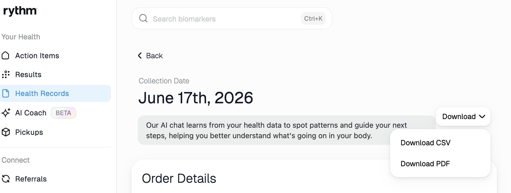

# Health

Aggregate all your health data into a single dashboard. 

Allows for uploading PDF, png, and apple health data all into a single place. 
Think of it like how YNAB, Mint, Monarch Money, Quicken aggregate all your bank accounts into a single place. Health is a self hosted dashboard that aggregates all your health data into a single place.

Self hostable in docker.

## Development

```bash
make dev
```

Installs client dependencies, starts the API server on port 3001 and the Vite dev server on port 5173 (with hot reload). Open `http://localhost:5173` in your browser, or use the mobile preview vscode extension

## Getting Your User ID

Create a user in the web UI or via `GET /api/users` to list existing users. The ID is auto-generated from the user's name.

## Auto Health Export

Use [Health Auto Export](https://www.healthexportapp.com/) with **three separate automations**, all pointing at:

```
http://your-dashboard:3001/api/{userId}/import/apple-health
```

Metrics are automatically mapped to the dashboard (e.g., `body_mass` → weight).

1. **Sleep** — Data Type: Health Metrics → select only *Sleep Analysis* → turn **Summarize Data off**.
   Sleep needs raw per-session data, not a daily summary. With Summarize Data on, HAE silently collapses every source (Apple Watch, a bed sensor, etc.) into a single point per night and picks just one, dropping the rest — even if you have multiple sources enabled under Preferred Sources. With it off, you get one row per sleep stage per source, which the dashboard reconstructs into a full per-source nightly breakdown itself.

2. **Health** — Data Type: Health Metrics → select every other metric you want tracked (weight, heart rate, labs, etc.) — **explicitly leave Sleep Analysis unchecked** here, since it's handled by the Sleep automation above. Keep Summarize Data on (default) for this one — per-session granularity isn't needed for these metrics, and turning it off can make the sync slow.

3. **Workouts** — Data Type: Workouts.

Keeping Sleep in its own automation (rather than turning off summarization for everything) avoids the slow background-sync issue HAE's own team warns about when disabling summarization across a large metric list.

## Import

You can import from CSV, PNG or PDF 

**Rythm Health**



**InBody**

Just drop the PDF/PNG/CSV into the 'import' page, AI will OCR then import values. 

## Related

https://github.com/nixfred/apple-health-dashboard
