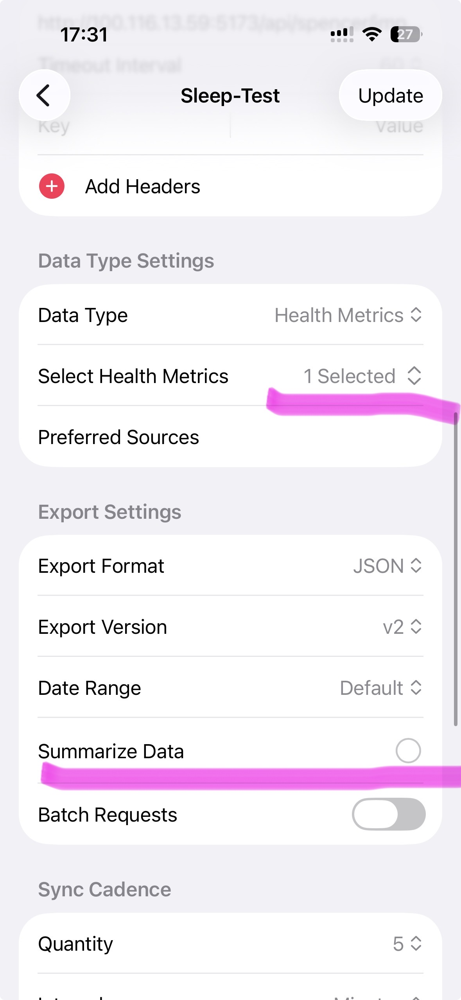
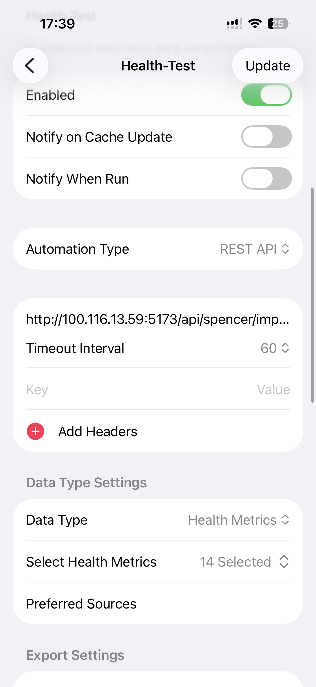
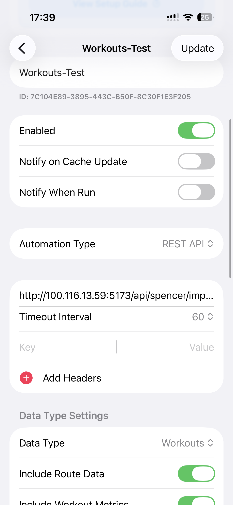

# Health

A self-hosted health dashboard that aggregates all your health data into a single place — Apple Health, lab work, DNA reports, and more. Think of it like how YNAB, Mint, Monarch Money, or Quicken pull every bank account into one view; Health does that for your body.

## What it does

- **Ingests health data from anywhere.** Live sync from Apple Health via the [Health Auto Export](https://www.healthexportapp.com/) app, plus manual upload of PDFs, PNGs, and CSVs (lab panels, InBody scans, DNA reports). AI-powered OCR (via the Anthropic API) reads scanned lab reports and PDFs and extracts structured values automatically.
- **Tracks the full picture, not just weight.** Body composition (weight, skeletal muscle mass, body fat %), sleep (per-source, per-stage breakdown), exercise and heart-rate zones, blood/lab markers with reference ranges, DNA traits, life events, and supplement/medication protocols.
- **Multi-user.** Each family member gets their own isolated profile and database, switchable from the sidebar.
- **Self-hosted.** One Docker image, one data volume — your data never leaves your own infrastructure.

## Architecture overview

- **Frontend** — React SPA built with Vite (`client/`), served as static files by the Express server.
- **Backend** — A single Express server (`server.js`) exposes a REST API per user (`/api/:userId/...`) for body metrics, blood labs, sleep, exercise, heart rate, DNA, events, and protocols.
- **Storage** — [`better-sqlite3`](https://github.com/WiseLibs/better-sqlite3), one database file per user, living in a single `/data` volume. A migration script (`scripts/migrate.js`) runs on every container start and is idempotent (safe to re-run, never overwrites existing rows).
- **OCR / parsing** — Uploaded PDFs and images are sent to the Anthropic API to extract structured lab values before they're written to the database, with a confirmation step in the UI before anything is saved.
- **Single Docker image** — A multi-stage build compiles `better-sqlite3` and the frontend, then ships a slim runtime image (see [Dockerfile](./Dockerfile)) with just the compiled backend, built frontend, and an entrypoint that seeds `/data` on first run.

## Development

```bash
make dev
```

Installs client dependencies, starts the API server on port 3001 and the Vite dev server on port 5173 (with hot reload). Open `http://localhost:5173` in your browser, or use the mobile preview vscode extension

## Deploying with Docker + Tailscale

The dashboard ships as a single Docker image and is designed to be reachable only over your [Tailscale](https://tailscale.com/) network — no public ports, no reverse proxy or TLS cert to manage. [`compose.yaml`](./compose.yaml) is already set up for **docktail** — a label-based sidecar that watches the Docker socket and auto-publishes containers onto your tailnet — so no manual `tailscale serve` config is needed:

```yaml
labels:
  - "docktail.service.enable=true"   # opt this container into docktail
  - "docktail.service.name=health"   # published as https://health.<your-tailnet>.ts.net
  - "docktail.service.port=3001"     # container port docktail proxies to
  - "docktail.service.service-port=443"  # port exposed on the tailnet (HTTPS)
```

1. **Run docktail** on the Docker host (once, outside this repo), pointed at the Docker socket so it can discover labeled containers.

2. **Run the dashboard:**

   ```bash
   docker compose up --build -d
   ```

   No `ports:` mapping is needed — docktail handles exposing the service on the tailnet, so the container only needs to be reachable on the Docker network. Data persists in a bind-mounted volume (`/data` in the container). Set `ANTHROPIC_API_KEY` in a `.env` file next to `compose.yaml`.

3. **Point Health Auto Export at the tailnet address** (`https://health.<your-tailnet>.ts.net`, not `localhost`) in the automations described below, so your iPhone can sync from anywhere, not just your home Wi-Fi.

## Getting Your User ID

Create a user in the web UI or via `GET /api/users` to list existing users. The ID is auto-generated from the user's name.

## Auto Health Export

Use [Health Auto Export](https://www.healthexportapp.com/) with **three separate automations**, all pointing at:

```
http://your-dashboard:3001/api/{userId}/import/apple-health
```

Metrics are automatically mapped to the dashboard (e.g., `body_mass` → weight).

1. **Sleep** — Data Type: Health Metrics → select only *Sleep Analysis* → turn **Summarize Data off**.
   Sleep needs raw per-session data, not a daily summary. With Summarize Data on, HAE silently collapses every source (Apple Watch, a bed sensor, etc.) into a single point per night and picks just one, dropping the rest — even if you have multiple sources enabled under Preferred Sources. With it off, you get one row per sleep stage per source, which the dashboard reconstructs into a full per-source nightly breakdown itself.

   

2. **Health** — Data Type: Health Metrics → select every other metric you want tracked (weight, heart rate, labs, etc.) — **explicitly leave Sleep Analysis unchecked** here, since it's handled by the Sleep automation above. Keep Summarize Data on (default) for this one — per-session granularity isn't needed for these metrics, and turning it off can make the sync slow.

   

3. **Workouts** — Data Type: Workouts.

   

Keeping Sleep in its own automation (rather than turning off summarization for everything) avoids the slow background-sync issue HAE's own team warns about when disabling summarization across a large metric list.

## Import

You can import from CSV, PNG or PDF 

**Rythm Health**


**InBody**

Just drop the PDF/PNG/CSV into the 'import' page, AI will OCR then import values. 

## Related

https://github.com/nixfred/apple-health-dashboard
